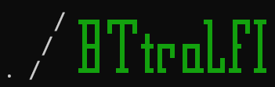
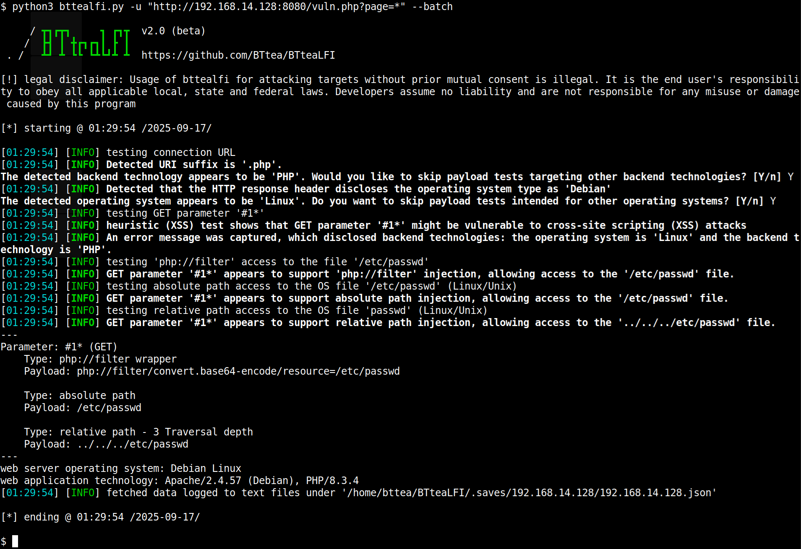
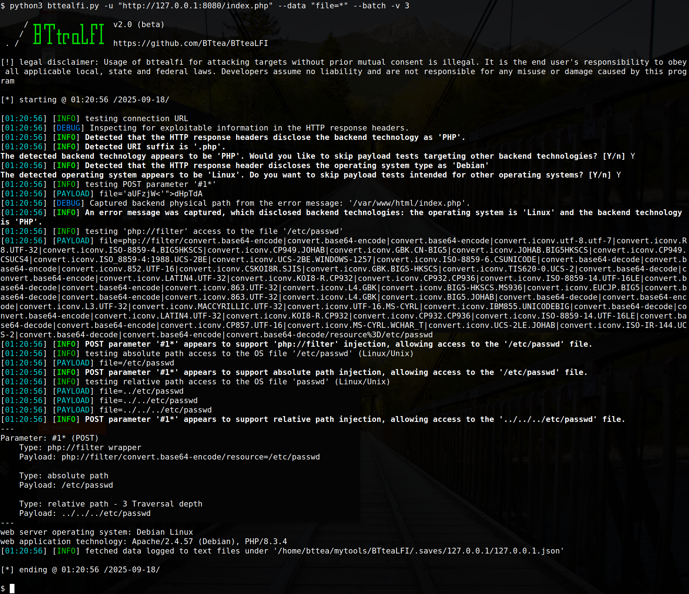
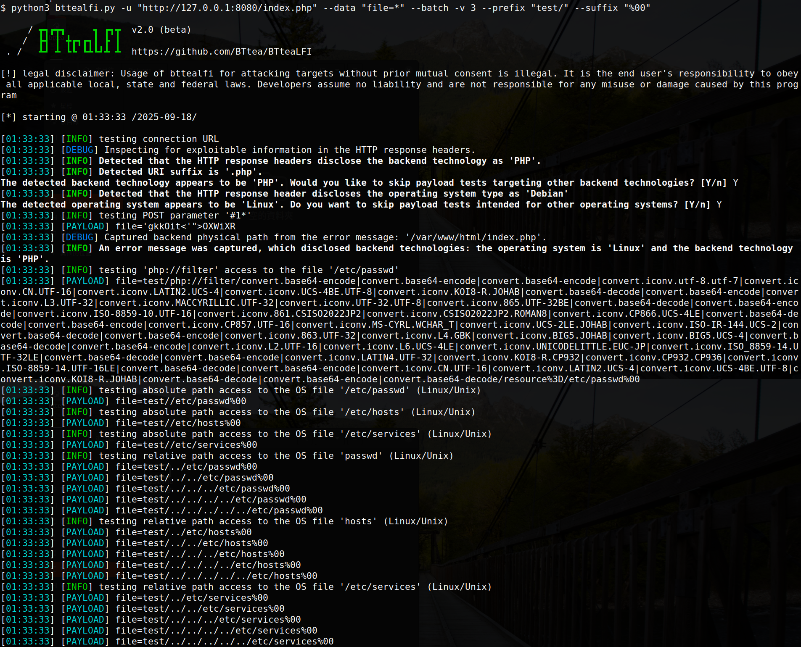
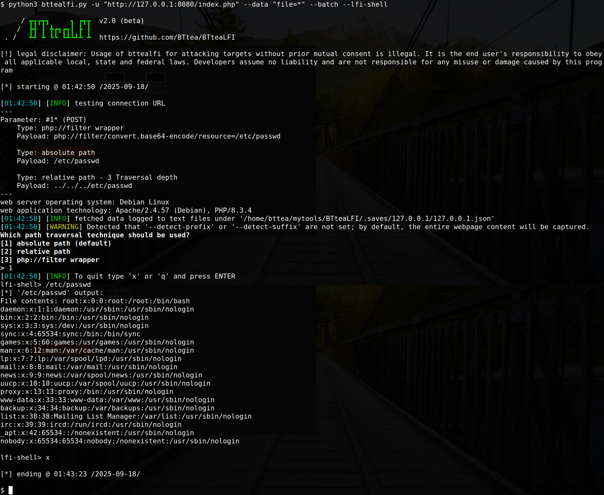
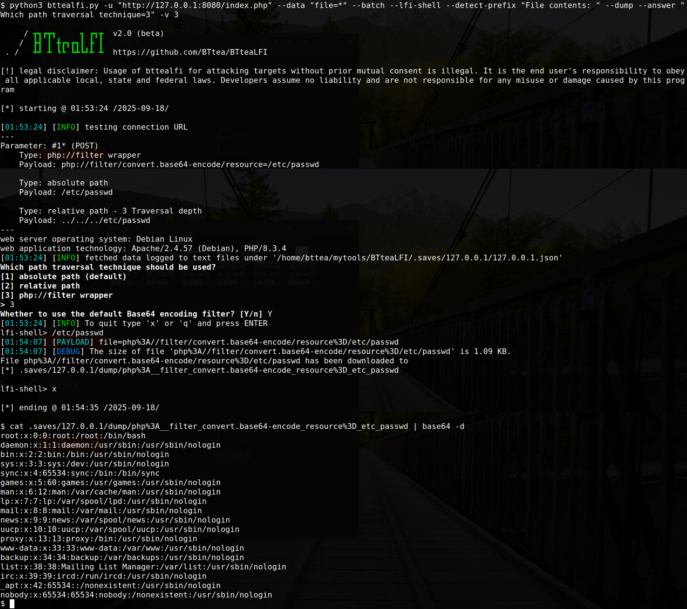

本專案採用 GNU 通用公共授權 v2.0 (GPLv2) 授權。
詳情請參閱"LICENSE.txt"文件。

當前版本為 `v2.0#beta.01`，有關更新日誌，請參閱 `ChangeLog.md`。

<div align="center">

# bttealfi


</div>


bttealfi 是一款開源滲透測試工具，可自動偵測並利用LFI漏洞，有豐富的參數，他使用一些內文檢測技術來嘗試挖掘潛在弱點，並且使用了與sqlmap相似的參數，如果滲透測試人員非常了解LFI弱點，您可以利用CVE-2024-4577來列舉文件(如果因WAF導致無法RCE)，或者具有SQL注入到LFI的權限，此工具可節省部分時間在列舉或下載文件，使其進一步洩漏目標資訊與弱點。

# 截圖


# 安裝

`git clone https://github.com/BTtea/BTteaLFI.git`

僅支援 Python 3.x 版本

# 使用

```
$ python bttealfi.py -h

     / ┳┓┏┳┓     ┓ ┏┓┳  v2.0#beta.01
    /  ┣┫ ┃ ╋┏┓┏┓┃ ┣ ┃
 . /   ┻┛ ┻ ┗┗ ┗┻┗┛┻ ┻  https://github.com/BTtea/BTteaLFI

optional arguments:
  -h, --help            show this help message and exit
  -p PARAM              Specify parameters
  --skip PARAM          skip parameters

Target:
  -u URL, --url URL     input URL
  --data DATA           POST data

General:
  --version             Show program's version number and exits
  -v DEBUG_LEVEL        debug information

Request:
  --method METHOD       Method
  --cookie COOKIE       cookie session
  -H HEADER, --header HEADER
                        headers
  --random-agent        Use randomly selected HTTP User-Agent header value
  --tamper TAMPER       tamper file
  --timeout Number      Time to wait for the web page response, default is 5 seconds
  --retries Number      Number of retries on connection failure, default is 3

Testing:
  --prefix PREFIX       Specify prefix
  --suffix SUFFIX       Specify suffix
  --technique TECHNIQUE
                        Specify testing techniques, Support RP, AP, and PHP_F options.
  --php-wrapper PHP_WRAPPER
                        Default test keywords for 'php://filter'
  --level {1,2,3}       File type detection level, the higher the level, the more file types can be detected. Default: 1
  --backend-app {all,php,aspx,jsp}
                        Web backend technology (php, asp, jsp). Default: all.
  --lfi-shell           Prompt for an interactive LFI shell
  --move Number         Number of path traversal levels, default is 5
  --path-depth Number   Traversal range for testing LFI path depth, default is 0
  --skip-xss            Skip XSS payload testing
  --test-skip Prompt    Skip payload tests for the specified prompt.

Detection:
  --detect-prefix DETECT_PREFIX
                        Context prefix for LFI file output
  --detect-suffix DETECT_SUFFIX
                        Context suffix for LFI file output
  --dump                Convert text output into a download

Output / Session:
  --batch               Never ask for user input, use the default behavior
  --answer ANSWER       Set predefined answers (e.g. "quit=N,follow=N")
  --flush-session       Flush session files for current target

Miscellaneous:
  --os OS type          Specify the backend operating system
```

* 基本參數，注入點請用'*'標記

  `python bttealfi.py -u "http://target/vuln.php?page=*" --batch`

  * POST

    `python bttealfi.py -u "http://target/vuln.php" --data "page=*" --batch`
  
  * JSON

    `python bttealfi.py -u "http://target/vuln.php" --data '{"page":"*"}' --batch`

* 清除成功注入紀錄

  `python bttealfi.py -u "http://target/vuln.php?page=*" --batch --flush-session`

* 你可以加上 -v 參數來設定顯示的訊息詳細內容 [0-6]

  `python bttealfi.py -u "http://target/vuln.php?page=*" --batch -v 3`

* 你可以透過參數--move來設置路徑移動的深度，預設為5

  `python bttealfi.py -u "http://target/vuln.php?page=*" --batch -v 3 --move 5`

  如果你已經知道路徑深度，不想遍歷，可以使用--depth-path

  `python bttealfi.py -u "http://target/vuln.php?page=*" --batch -v 3 --depth-path 8`

* 你可以使用--test-skip 來指定提示訊息來跳過不想測試的負載，例如info中出現passwd或relative path access的訊息

  `python bttealfi.py -u "http://target/vuln.php?page=*" --batch -v 3 --test-skip "passwd,relative path access"`

* 你可以透過新增前後綴來自定義注入的payload

  `python bttealfi.py -u "http://target/vuln.php?page=*" --batch -v 3 --prefix "test/" --suffix "%00"`

* 如果目標存在WAF或者過濾器，可以使用參數 --tamper 來飲用以定義的繞過腳本，你也可以自己根據規則撰寫並使工具引用，如須繞過多種規則也可以將腳本用逗號隔開一起使用(腳本轉換使用先進先出)

  `python bttealfi.py -u "http://target/vuln.php?page=*" --batch -v 3 --tamper dotslashobfuscate,base64encode`

* 當你成功利用目標並列出payload時，可以使用 --lfi-shell 參數來方便列舉目標系統上的檔案

  `python bttealfi.py -u "http://target/vuln.php?page=*" --batch -v 3 --lfi-shell`

  如果目標的回應訊息太多多餘資訊，影響原本獲取的文件內容，可配合使用 --detect-prefix 與 --detect-suffix 來指定要捕捉的內容範圍

  `python bttealfi.py -u "http://target/vuln.php?page=*" --batch -v 3 --lfi-shell --detect-prefix "內容前綴" --detect-suffix "內容後綴"`

  如果不需要顯示內容，或者你可能只是要下載一些二進制文件，可以配合使用 --dump 參數來將輸入的檔案自動儲存至本地

  `python bttealfi.py -u "http://target/vuln.php?page=*" --batch -v 3 --lfi-shell --dump`

# 一些演示截圖
#### 使用除錯參數


#### 自定義前後綴


#### 使用`--lfi-shell`參數來快速遍歷檔案內容


#### 使用`--detect-prefix`來定義前綴用以限制捕捉的內容，並使用`--dump`來將取得的內容儲存在本地(不顯示)，並且使用`--answer`來定義有出現提問時來指定所選的回應



# 心得筆記
sqlmap真的是一款完美且優秀的工具，使我在滲透上的工作變的便利且快速，然而卻沒有一款針對LFI的自動化工具真正讓我覺得好用，並且我也厭倦了每一次發現LFI弱點都需要重新設計利用腳本，因此，我開啟的這個專案並根據自身經驗，參考sqlmap上的一些運作行為，來嘗試將LFI利用武器化，而我認為不直接參考sqlmap程式碼是我給自己的一種挑戰，每完成一個功能便越來越覺得sqlmap是一個真正厲害且優雅的工具。

然而此專案並非我預期的結果，有許多我想實現但尚未實作進去的功能(皆因自身程式設計經驗不足所導致後期程式碼難以維護)，事實上，我將計畫準備進行第四次重構😉。


# 未來開發目標
* 重構程式碼並將可以模組化的功能以及冗長的寫法進行優化
* 新增4096(linux)與256(windows)後綴截斷測試技術
* 新增RFI，SSRF測試技術
* 新增各種包裝器偵測技術
* 新增參數 --phpinfo
* 新增關鍵參數 --os-shell
* --os-shell功能衍伸
  * 可根據所有已檢測到的技術進行每種技術的RCE利用
  * 新增pearcmd.php的偵測與利用
  * 新增CVE-2012-1823的偵測與利用
  * 新增CVE-2024-4577的偵測與利用
  * 新增CVE-2024-2961的偵測與利用
  * 新增phpinfo.php的條件競爭利用
  * 新增Session Upload Progress的條件競爭利用
