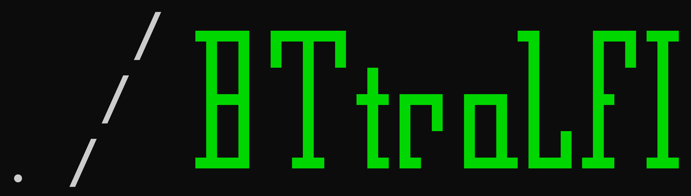
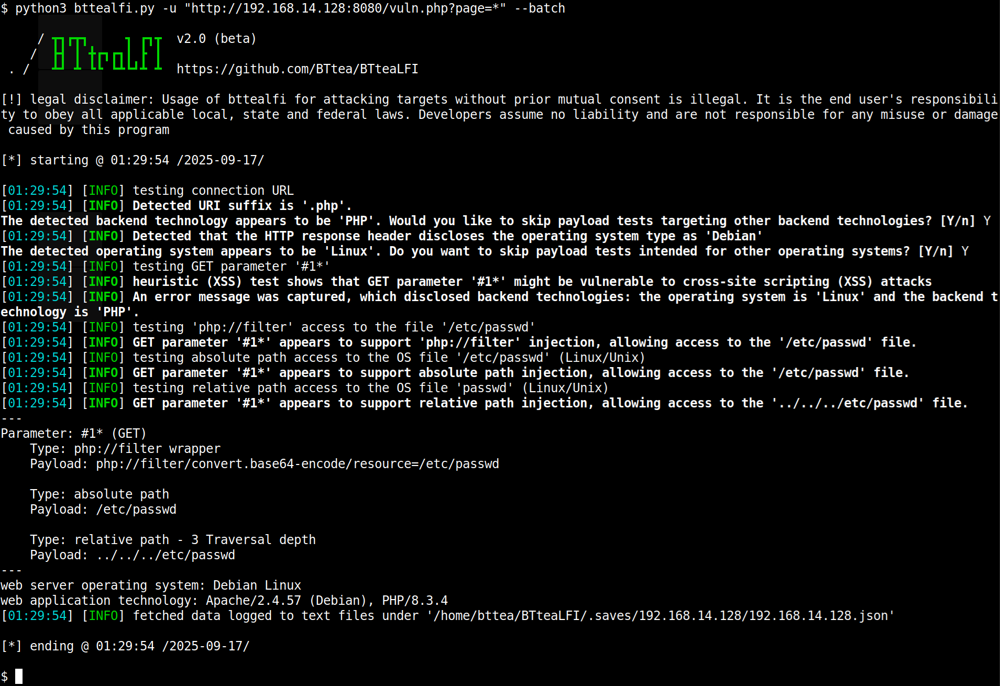

This project is licensed under the GNU General Public License v2.0 (GPLv2).
See the 'LICENSE.txt' file for details.

Current version: `v2.0#beta.01`, For the changelog, please see `ChangeLog.md`.

<div align="center">

# bttealfi


</div>

bttealfi is an open-source penetration testing tool that can automatically detect and exploit LFI vulnerabilities. It offers a wide range of parameters and uses content-based detection techniques to try to uncover potential weaknesses.

If a penetration tester is highly familiar with LFI vulnerabilities, they can leverage CVE-2024-4577 to enumerate files (in cases where RCE is blocked by a WAF), or if they have SQL injection-to-LFI access, this tool can save time on enumerating or downloading files, thereby further exposing target information and weaknesses.

# Screenshots


# Installation

`git clone https://github.com/BTtea/BTteaLFI.git`

Only supports Python 3.x versions

# Usage

```
$ python bttealfi.py -h

     / ┳┓┏┳┓     ┓ ┏┓┳  v2.0#beta.01
    /  ┣┫ ┃ ╋┏┓┏┓┃ ┣ ┃
 . /   ┻┛ ┻ ┗┗ ┗┻┗┛┻ ┻  https://github.com/BTtea/BTteaLFI

optional arguments:
  -h, --help            show this help message and exit
  -p PARAM              Specify parameters
  --skip PARAM          skip parameters

Target:
  -u URL, --url URL     input URL
  --data DATA           POST data

General:
  --version             Show program's version number and exits
  -v DEBUG_LEVEL        debug information

Request:
  --method METHOD       Method
  --cookie COOKIE       cookie session
  -H HEADER, --header HEADER
                        headers
  --random-agent        Use randomly selected HTTP User-Agent header value
  --tamper TAMPER       tamper file
  --timeout Number      Time to wait for the web page response, default is 5 seconds
  --retries Number      Number of retries on connection failure, default is 3

Testing:
  --prefix PREFIX       Specify prefix
  --suffix SUFFIX       Specify suffix
  --technique TECHNIQUE
                        Specify testing techniques, Support RP, AP, and PHP_F options.
  --php-wrapper PHP_WRAPPER
                        Default test keywords for 'php://filter'
  --level {1,2,3}       File type detection level, the higher the level, the more file types can be detected. Default: 1
  --backend-app {all,php,aspx,jsp}
                        Web backend technology (php, asp, jsp). Default: all.
  --lfi-shell           Prompt for an interactive LFI shell
  --move Number         Number of path traversal levels, default is 5
  --path-depth Number   Traversal range for testing LFI path depth, default is 0
  --skip-xss            Skip XSS payload testing
  --test-skip Prompt    Skip payload tests for the specified prompt.

Detection:
  --detect-prefix DETECT_PREFIX
                        Context prefix for LFI file output
  --detect-suffix DETECT_SUFFIX
                        Context suffix for LFI file output
  --dump                Convert text output into a download

Output / Session:
  --batch               Never ask for user input, use the default behavior
  --answer ANSWER       Set predefined answers (e.g. "quit=N,follow=N")
  --flush-session       Flush session files for current target

Miscellaneous:
  --os OS type          Specify the backend operating system
```

* Basic parameters: mark the injection point with '*'

  `python bttealfi.py -u "http://target/vuln.php?page=*" --batch`

  * POST

    `python bttealfi.py -u "http://target/vuln.php" --data "page=*" --batch`
  
  * JSON

    `python bttealfi.py -u "http://target/vuln.php" --data '{"page":"*"}' --batch`

* Clear successful injection records

  `python bttealfi.py -u "http://target/vuln.php?page=*" --batch --flush-session`

* You can add the `-v` parameter to set the verbosity level of messages [0-6]

  `python bttealfi.py -u "http://target/vuln.php?page=*" --batch -v 3`

* You can use the `--move` parameter to set the path traversal depth, default is 5

  `python bttealfi.py -u "http://target/vuln.php?page=*" --batch -v 3 --move 5`

  If you already know the path depth and don’t want to traverse, use `--depth-path`

  `python bttealfi.py -u "http://target/vuln.php?page=*" --batch -v 3 --depth-path 8`

* You can use `--test-skip` to skip testing certain payloads based on the messages, for example if the info contains `passwd` or `relative path access`

  `python bttealfi.py -u "http://target/vuln.php?page=*" --batch -v 3 --test-skip "passwd,relative path access"`

* You can customize the payload by adding a prefix and/or suffix

  `python bttealfi.py -u "http://target/vuln.php?page=*" --batch -v 3 --prefix "test/" --suffix "%00"`

* If the target has a WAF or filters, you can use the `--tamper` parameter to apply predefined bypass scripts. You can also write your own scripts for the tool to use. To bypass multiple rules, separate scripts with commas (FIFO order is applied)

  `python bttealfi.py -u "http://target/vuln.php?page=*" --batch -v 3 --tamper dotslashobfuscate,base64encode`

* When you successfully exploit the target and list payloads, use `--lfi-shell` to easily enumerate files on the target system

  `python bttealfi.py -u "http://target/vuln.php?page=*" --batch -v 3 --lfi-shell`

  If the target’s response contains too much extra information, affecting the retrieved file content, use `--detect-prefix` and `--detect-suffix` to specify the content range to capture

  `python bttealfi.py -u "http://target/vuln.php?page=*" --batch -v 3 --lfi-shell --detect-prefix "content prefix" --detect-suffix "content suffix"`

  If you don’t need to display content, or you just want to download some binary files, use `--dump` to automatically save the retrieved files locally

  `python bttealfi.py -u "http://target/vuln.php?page=*" --batch -v 3 --lfi-shell --dump`

# Some demo screenshots
#### Using debug parameters


#### Custom prefixes and suffixes


#### Use the `--lfi-shell` parameter to quickly traverse file contents


#### Use `--detect-prefix` to define a prefix to limit captured content, and use `--dump` to save the retrieved content locally (without displaying it). Additionally, use `--answer` to specify the chosen response when a prompt appears.


# Notes
Sqlmap is truly a perfect and outstanding tool, making my penetration testing work convenient and fast. However, there isn’t a fully automated tool for LFI that I find really practical. I also grew tired of having to redesign exploitation scripts every time I discovered an LFI vulnerability. Therefore, I started this project based on my own experience and by referencing some operational behaviors of sqlmap, attempting to weaponize LFI exploitation. I intentionally chose not to directly reference sqlmap’s code as a personal challenge. Every time I complete a feature, I increasingly appreciate how truly powerful and elegant sqlmap is.

That said, this project has not fully met my expectations. There are many features I want to implement but haven’t yet, mostly due to my limited programming experience, which makes maintaining the code difficult. In fact, I am preparing for a fourth refactoring of this project 😉.


# Future Development Goals
* Refactor the code and optimize modularizable functions as well as verbose implementations
* Introduce 4096 (Linux) and 256 (Windows) suffix truncation testing techniques
* Added RFI and SSRF testing techniques
* Added detection techniques for various wrappers
* Add a new parameter `-r`
* Add a new parameter `--phpinfo`
* Add a key parameter `--os-shell`
* Extensions of the `--os-shell` feature:
  * Exploit RCE for all detected techniques
  * Detect and exploit pearcmd.php
  * Detect and exploit CVE-2012-1823
  * Detect and exploit CVE-2024-4577
  * Detect and exploit CVE-2024-2961
  * Exploit phpinfo.php through race conditions
  * Exploit Session Upload Progress via race conditions


# Acknowledgements
* Thanks to `onefiresticks` for guidance on code architecture design.
* Thanks to `fzwww` for helping optimize parts of the source code.
* Thanks to `r888800009` for guidance and suggestions on modularization during the fourth refactor.