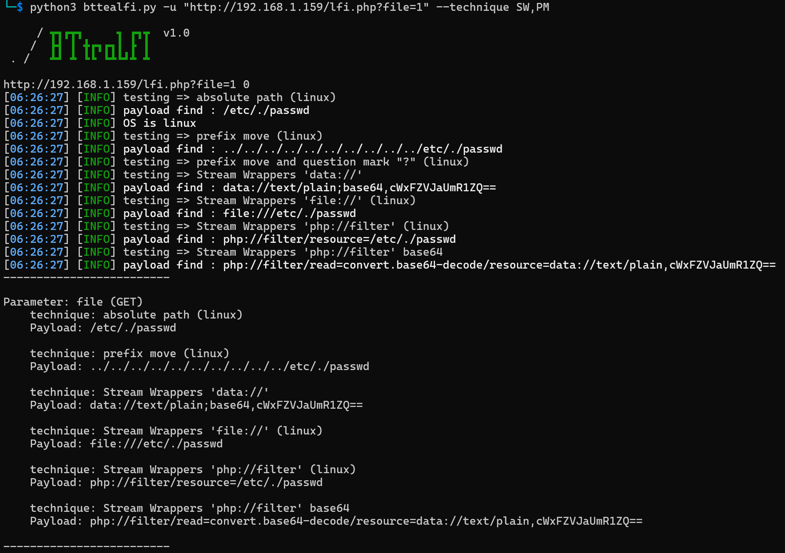
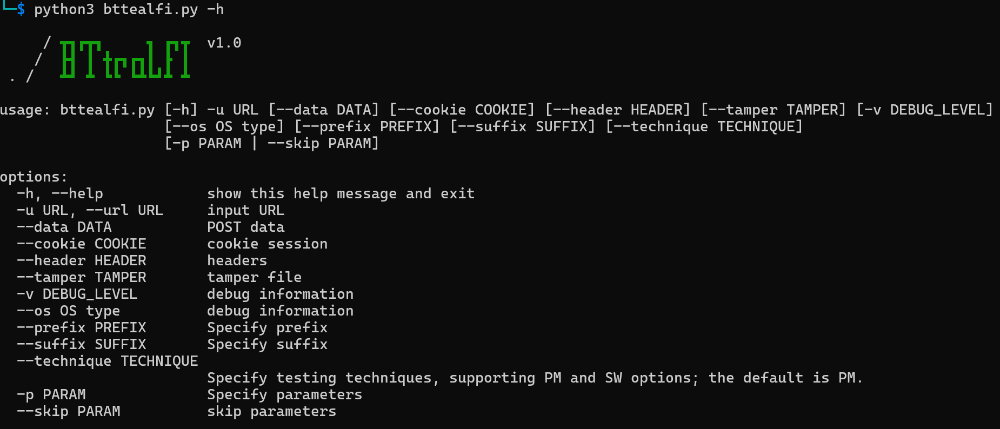

# LFI vulnerability scanning tool

*Used for identifying and discovering exploitable LFI vulnerabilities.*

**This PoC is for learning and research purposes only. Do not use it for illegal activities; you are solely responsible for any legal consequences.**

**Note that this tool cannot comprehensively detect the existence of LFI exploits. It is designed to partially identify simple exploitable vulnerabilities and includes some built-in filter bypass mechanisms. If you are a penetration tester or a red team specialist, it is recommended to attempt manual testing, as it may prove more effective than relying solely on this tool.**

# Screenshots

## Tool Usage
* You need to install the dependencies:

  `$ python3 -m pip install requests`

* Run the script directly to get usage instructions.

  `$ python3 bttealfi.py -h`
  
  